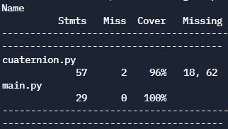

# Pregunta 4 : Cuaterniones

Este programa contiene una clase que define el tipo Cuaternion que permite realizar operaciones con numeros mediante la sobrecarga de operaciones suma y multiplicación.

- La suma de cuaterniones se realiza con la suma binaria.
- La multiplicación de cuaterniones se realiza con la multiplicación binaria.
- La conjugada de cuaterniones se realiza con el símbolo ~ o -.
Por ejemplo, la conjugada del cuaternion a puede ser ~a o -a

- El valor absoluto de un cuaternion puede obtenerse con la suma unaria, por lo que el valor absoluto del cuaternión a es +a

## ¿Cómo correr el programa?
Solo se incluyen los archivos cuaternion.py y unitTest.py. Por lo que si se desea llamar a la clase Cuaternion en cuaternion.py se puede modificar el código de este archivo y realiza las llamadas al final de la clase o importar la clase en otro archivo de Python y hacer uso de las propiedades del tipo Cuaternion.
Se puede importar de la siguiente manera: 

    from cuaternion import Cuaternion
    def main():
          ......

## Unit Test y Code Coverage
Durante el unit test realizado con el archivo unitTest.py todos los tests fueron completados de manera satisfactoria con la librería unittest de Python. Y se obtuvo un code coverage de 96%

